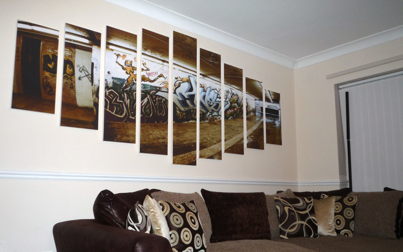

# diptych
micro-library for rendering diptychs, triptychs, and other canvas split style images, as div groups

## What is a diptych?

These are diptychs:

These are triptychs:

And these are canvas splits (because nobody wants to say polyptych):

